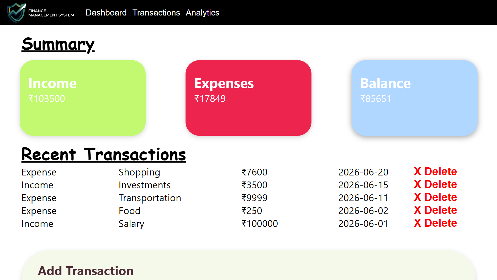
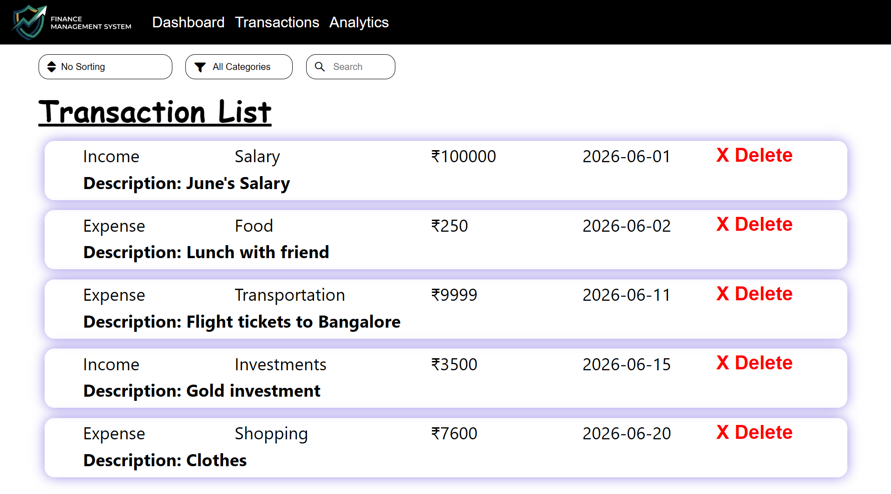
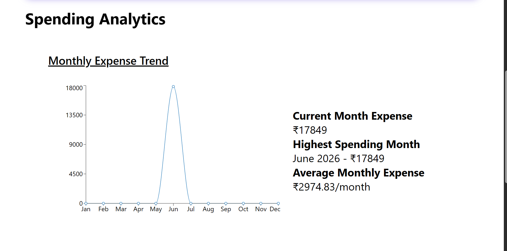
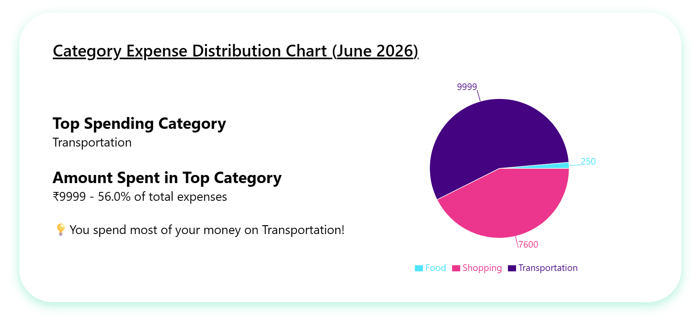
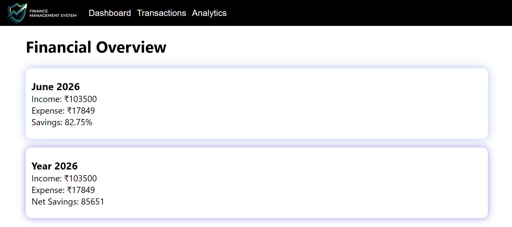

# FinTrack - Personal Finance Management Platform

## Live Demo

🔗 [Live Application](YOUR_VERCEL_LINK)

---

## Project Status

⚠️ **This project is currently under active development.**

* Bugs are being fixed and improvements are ongoing.
* Some features may not be fully implemented or accessible.
* UI responsiveness across different screen sizes is currently being worked on.
* Additional features and enhancements are planned for future releases.

---

## Problem Statement

Managing personal finances manually can make it difficult to track spending habits, monitor financial performance, and gain meaningful insights from financial data.

FinTrack aims to provide a centralized platform where users can record transactions, monitor income and expenses, and visualize financial activity through intuitive dashboards and analytics.

---

## Overview

FinTrack is a React-based Personal Finance Management Platform designed to help users organize and analyze their financial data. The application provides transaction management, financial summaries, and data visualizations to support better financial decision-making.

---

## Current Features

### Transaction Management
- Add income and expense transactions
- Categorize transactions
- View transaction history
- Delete transactions

### Financial Overview
- Current Balance
- Total Income Tracking
- Total Expense Tracking
- Savings Monitoring

### Analytics Dashboard
- Monthly Spending Analytics
- Category-wise Expense Distribution
- Spending Trend Visualizations
- Interactive Charts

### Search & Filtering
- Search Transactions
- Filter Transactions by Type
- Dynamic Transaction Views

### Data Persistence
- Local Storage Integration
- Automatic Data Retention Across Sessions

### User Experience
- Real-Time Updates
- Dynamic Rendering
- Clean and Intuitive Interface

---

## Tech Stack

**Frontend**

* React.js
* JavaScript (ES6+)
* CSS3

**Data Visualization**

* Recharts

**Deployment**

* Vercel

**Version Control**

* Git & GitHub

---

## Installation

### Clone the Repository

```bash
git clone https://github.com/TechTrooper05/fintrack.git
```

### Navigate to the Project Directory

```bash
cd fintrack
```

### Install Dependencies

```bash
npm install
```

### Start Development Server

```bash
npm start
```

### Create Production Build

```bash
npm run build
```

---

## Future Enhancements

- Budget Management System
- Savings Goal Tracking
- User Authentication & User Profiles
- Cloud Database Integration
- Multi-Device Data Synchronization
- Advanced Financial Analytics & Forecasting
- AI-Powered Spending Insights
- Export Reports (PDF/CSV)
- Progressive Web App (PWA) Support
- Responsive Design for Mobile and Tablet Devices

---

## Screenshots

Add screenshots of:

* Dashboard

* Transaction Management

* Analytics Section


* Financial Overview


---

## Learning Outcomes

This project helped strengthen my understanding of:

* React Component Architecture
* State Management
* Data Visualization
* Dynamic Rendering
* Frontend Development Best Practices
* Application Deployment
* Git and GitHub Workflow

---

## License

This project is licensed under the MIT License.
